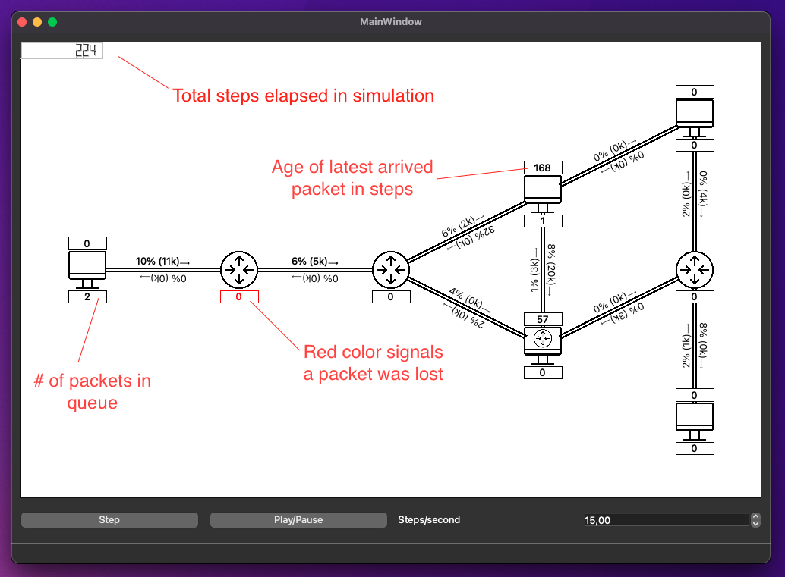

 
# Overview

We have implemented a software based network simulator. The simulator has all the basic features listed in A+ and a GUI based on Qt.

 
The simulation is configured with a json file (see format in doc/example-json.pdf in repository) which determines the nodes, links and the applications that generate and receive packets. The nodes can be routers that just forward packets or end-hosts that also run an application. Some end-hosts also have routing capabilities and this is defined in the json file. Links have a transmission speed and a propagation delay. Packets that are in transit between two nodes are stored in either nodes waiting for transmission to the next link or in links along the path if the link's propagation delay is high. The end-hosts have an application that sends packets according to the instructions given in the configuration file and the packets it receives. All packets have ID, source address, destination address, size, age and transmission status attributes.
The simulator has a **GUI** that visualizes the network and the movement of packets. The GUI shows the amount of packets queued up at the nodes (text box below a node), the age of the most recently received packet (above the node, in steps) and links will show their status (utilization % and cumulative amount of kilobytes transmitted). The simulation can be paused and its speed can be changed with the GUI. The simulation can also be advanced a single step at a time.
The program is used by first configuring the simulation with a JSON file that is then read by the program. The simulation is then run by the program and shown to the user.
The simulation also features **different queue types** for Nodes. These different queues can drop packets in various ways and it is easy to define new types. The queues are given their parameters in the JSON file. When a packet is dropped, it is visualized by turning the information box below the node red. Currently, we have implemented a regular queue, one that drops any single packet with a certain likelihood (given as parameter in JSON), and one that drops packets as long as its queue is at max capacity (given as parameter in JSON).
The simulation works by running smaller simulation steps for every element. We do this by looping the nodes and links, and moving the packets forward accordingly. For example, simulating a node starts by popping its queue and starting to push that packet to the link, and towards the next node. Finally if the transmission status in the simulation is calculated to be ready the packet's ownership is transferred to another node by pushing it to another node's queue.
 
# Software structure

The Packet class represents packets in the network. A single packet can be in a Link or a Node at a single point in time. Packets have sizes, source addresses and destination addresses. 
The Link class represents links between nodes. Links contain a vector of packets that are currently being transferred. Links have different transmission speeds, propagation delays and maximum throughputs. 
The Node class is an abstract class that is inherited by different types of nodes. Nodes have links connected to the node and a Queue of packets that haven’t been forwarded or processed yet. Nodes have addresses and lookup tables for packet forwarding. The node class is inherited by different types of nodes.
The Router node only routes packets but doesn’t affect them. If a packet’s destination is the router, the packet is destroyed. The EndHost node runs an application that creates packets. EndHosts don’t route packets that don’t originate from the EndHost. The RoutingEndHost node inherits from both the router and the EndHost. RoutingEndHosts run applications as well as route incoming packets to other nodes. 
The Queue class extends std::vector and is a container for packets inside a node. There are three types of queues. NoDropQueue which never drops packets, RandomDropQueue which has a probability based chance to drop a packet and a sizeConstrainQueue that drops packets if their count exceeds the Queues maximum size. 
The Application class is an abstract class that is inherited by different types of applications. The Applications create packets that the node running the application sends forward. Different applications create packets with different conditions. 
The SimpleApplication creates a single packet in intervals. The BurstApplication creates multiple packets in intervals. The RespondingApplication creates packets when the node running the application receives a packet. The ReceivingApplication doesn’t create packets. 
The Network class contains all the links and the nodes of the simulation. The network advances the simulation by calling methods of the links and nodes. The Network class also is used in creating the simulation by adding nodes, links and routing tables by reading a Json file. 
The MainWindow class implements the simulation’s GUI and the timer that calls the network's runOneTick() method. The MainWindow is the main interface between the QT library and the program logic. 
The resources directory contains the Json file that the program loads on startup as well as the pictures used for the different types of nodes. 
The tests directory contains the NetworkTest class which contains unit tests. 

# Instructions for building and using the software

QtCreator is needed for the program to build and run. Although the project is done with Qt6 in mind, Qt5 (available on Aalto Linux machines) should also be able to do the job. 
Open QtCreator and select “Open Project”. Then, navigate to the project root and select file “CMakeLists.txt”, select it and hit enter. The project opens in QtCreator. Then simply run the program, and the app should start.

## User guide

The simulation has a step button that advances the simulation by a single tick and a play/pause button that automatically advances the simulation by a chosen amount. The program can load different networks as a .json file from the file button. 

# Testing

The program is tested with some unit tests as well as with faulty json-files. Since it is a simple and visual application with no runtime inputs (except for advancing the simulation by a step or continuously), testing it manually by seeing it run and following the packets has been easy and extensive. 
 
# Work log
 
## Everyone

**Total time spent on meetings**

- 3x official weekly meetings 5h
- Unofficial meetings 6h

**Total time spent on project documents** 

- 6h
 
## Eemeli

Work hours are estimates

**Week 46**

- Learning Qt (5h)
- Initializing Qt project (5h)

**Week 47**

- Drawing on QGraphicsView (3h)
- Rendering a actual node (5h)

**Week 48**

- File format and its loading (4h)
- Rendering all nodes distinctly (1h)
- Dynamic link rendering (4h)
- Qt embedded resource handling (2h)
- "Event loop" for simulation that renders on gui (3h)
- Parametric apps file format
- Other gui related stuff (5h)

**Week 49**

- Statistics rendering (1h)
- Gui stuff (6h)
- Convert the project into a library (5h)

 
## Joonas

**week 46**

- Setting up own development environment 5h
- Reading up on Qt -3h

**week 47**

- Creation of project header files -3h
- Creation of basic methods for network creation - 3h

**week 48**

- Planning and implementation of different types of applications -5h

**week 49**

- Adding more applications and refactoring applications -2h
- Adding parameters to applications -2h
 
## Samuli

- Some hour estimates are quite rough, precise time tracking was not always remembered.

**week 46**

- Set up Qt dev environment (3h)
- Learn Qt usage (4h)
- Get to know project and draft potential architecture (2h)

**week 47**

- Learn more Qt functionalities (2h)
- Implement first version of Node and its subclasses (4h)
- Start designing routing table generation (my version never used) (1h)

**week 48**

- Refactor Nodes to match new design (2h)
- Comment and document (1h)

**week 49**

- Refactor Nodes again (2h)
- Refactor Network to match new Node design (1h)
- Plan and Implement Queues (5h)
- Comment and Document (1h)
- Refactor Node, EndHost, Router, RoutingEndHost and Network to support the use of Queues (2h)
- Add a Queue for all Nodes in Network.json and Implement GUI visualization of Queue dropping packets (1h)
 
## Tuomo

**Week 46**

- Setting up development environment 3h
- Learn Qt 3h

**Week 47**

- Draft of main simulation logic 4h
- Implement link and packet classes 3h

**Week 48**

- Implement routing tables for nodes 4h

**Week 49**

- Add methods for receiving statistics data 3h
- Fix node inheritance 1h
- Bug fixes 1h
- Add tests 2h

