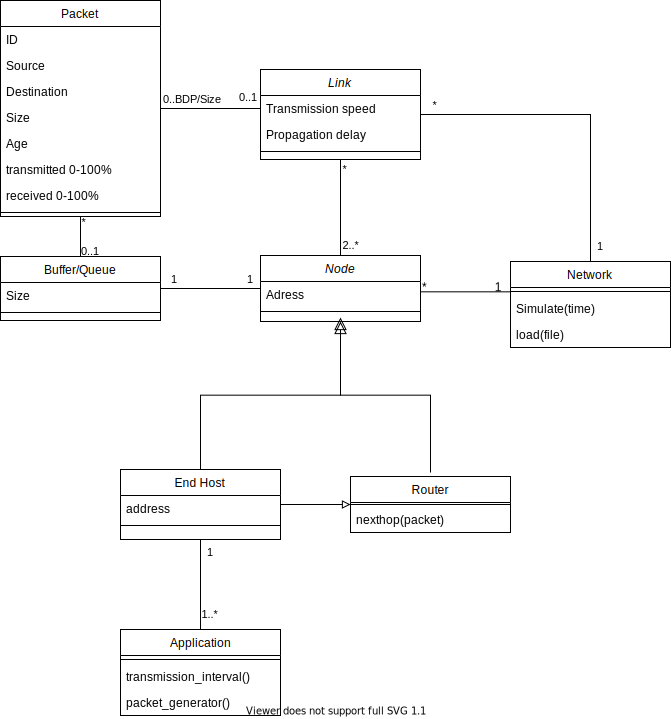

# Scope of project

The aim of our project is to implement a software based network simulator. The simulator will have all the basic features listed in A+ and a GUI based on Qt. 

The simulation is configured with a json file which determines the nodes, links and the applications that generate and receive packets. The nodes can be routers that just forward packets or end-hosts that also run an application. Links have a transmission speed and a propagation delay. Packets that are in transit between two nodes are stored in either nodes in the routing path or in links along the path if the link's propagation delay is high. The end-hosts have an application that sends packets according to the instructions given in the configuration file and the packets it receives. All packets have ID, source address, destination address, size, age and transmission status attributes. 

The simulator will have a GUI that shows the network and the packets along their route. The GUI will also show the amount of packets queued up at the nodes and other relevant information about the network's performance. The simulation can be paused and its speed can be changed with the GUI. 

The program is used by first configuring the simulation with a JSON file that is then read by the program. The simulation is then run by the program and shown to the user. The user can change the simulation speed and pause/unpause the simulation with the GUI.

The simulation works by running smaller simulation steps for every element. We will do this by looping the nodes and links, and moving the packets forward accordingly. For example, simulating a node starts by popping its queue and starting to push that packet to the link, and towards the next node. Finally if the transmission status in the simulation is calculated to be ready the packet's ownership is transferred to another node by pushing it to another node's queue.

# High level structure

We created a UML class diagram with drawio to illustrate the initial plan for the class structure of the core classes and their relations, as shown by [@fig:uml1].

{#fig:uml1}

## Class structure

The Network class keeps track of the simulation time with a timer as well as contains all of the nodes and the links of the program. The network is initialised in the class constructor. It also works as the interface between the network logic and the GUI. 

The Node class is an abstract class that contains the address of the node and a buffer of packets that need to be transferred to other nodes. The Node class is inherited by the End Host and Router classes. Routers forward packages to other nodes.

The End Host class inherits the Router class and the Node class because an End Host can work as a router. An end host can send packets to other addresses (nodes) as well as receive packets with its address. The End Host runs an Application that generates and sends packets in intervals. 

The Link class represents links in between the nodes. Links have a transmission speed that limits the amount of information (number of packets) that can be sent from node to node per unit of time. Propagation delay is the amount of time that it takes for a packet to be transferred to another node. 

Instances of the Packet class represent data sent through the network. Packets have identifiers, different sizes, destinations and statuses depending on what percentage of the package has been passed through a link. The packets also carry information about the source of the packet. 

Packets are stored in Buffers that have a size limit depending on the node that the Buffer is in. 

The GUI isn’t included in the diagram as its exact implementation is still in consideration. Currently our plan is to add classes that inherit the QtGraphicsItem. 

# External libraries 

We are building a graphical user interface to visualise the simulation. We will use the suggested Qt framework. We aim to use Qt extensively and use Qt widgets to visualise the state of simulation. 

More specifically and based on the Qt documentation example [@elasticnodes], we will visualise network elements on a QGraphicsScene class instance. According to Qt documentation, "The QGraphicsScene class provides a surface for managing a large number of 2D graphical items." which should offer a performant and flexible tool for us. 

The QtGraphicsScene consists of QtGraphicsItems. Thus everything we want to visualise will need to be an instance of QtGraphicsItem. The network nodes, links and packages will at least be such instances. 

Another place for an external library is the configuration of the network simulation. We plan to develop a file based solution which loads the network topology and end host applications to the simulation. As a common choice of file format, we will use json. However, it seems that Qt Core supports json natively, thus the need for a json library is already satisfied by our choice of GUI library.  

For testing we plan to also use Qt's own tools. We plan to use Qt Test to write our unit tests for the simulator.

# Division of work

_Very preliminary starting point; will be updated_

**Eemeli** is most engaged and responsible for libraries and Qt management.
**Samuli**, **Tuomo** and **Joonas** will focus more on implementing the core logic.

# Work agreement

After initial conversations, we have decided to collectively aim for the best available grade (5) for this project and chose the scope of the project accordingly (pending clarification from TA; at this time, we are unsure of how many additional features should be implemented for a grade 5 complexity). Everyone in the team understands what this goal means and is prepared to put in work accordingly during the four weeks.

We have decided to hold dailies weekly to catch up on everyone’s work and potential sources of issues. These dailies, as well as all other formal meetings will be recorded as (simple) meeting notes so that everyone can check what was discussed if absent.

Work is done flexibly, either in group, subgroup or at an individual level depending on availability and preferences. If ad hoc meetings related to working (or especially planning) are held, it is important to summarise any decisions or important observations made to others via Telegram or other channels so that everyone is on the same page.

Our primary communication tool is Telegram as it is flexible and suitable enough for discussions on a small scale project like this. If need be, the team has access to a Teams channel provided by the course staff for more structured conversation.

Agreed meetings are attended by everyone unless otherwise indicated; opt-out, not opt-in.

# Schedule & milestones

**Weekly schedule**

Dailies + planning on Thursdays at a flexible time. 
TA meeting on Fridays @ 10:00.

**Milestones**:

- Development environment and libraries set up
- Core logic (class Network)
- Routers and end-hosts (Node and its subclasses, Queue)
- Links (class Link)
- Functionality complete (without GUI)
- Implementing GUI
- Finishing documentation (documented along the way, but refined at the end)

\newpage

# References

